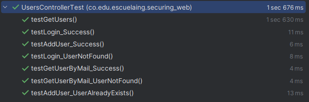

# TallerSecuriy

Este proyecto consiste en la creación de una arquitectura básica que abarca la seguridad de STP, certificados de DNS, encriptación de credenciales y seguridad en REST API.

## Arquitectura

- **Cliente HTML + JS**: Visualización del login de usuario. A través de peticiones Fetch API, se realizarán las solicitudes al backend para el login y la visualización de usuarios.
- **Apache server**: Este servidor va a hospedar los archivos estáticos para la funcionalidad del cliente, además de otorgarle el certificado del DNS para el protocolo HTTPS.
- **Backend Spring Boot**: Lógica del modelo de datos y de seguridad. Certificado de DNS para HTTPS.

**Se utilizaron dos máquinas EC2**: una para el servidor Apache y otra para el backend Spring Boot.

## Descripción de seguridad

Aquí se presenta una descripción resumida de las medidas de seguridad implementadas en el proyecto:

### SSL/TLS y Certificados

Se implementó el protocolo HTTPS en ambos servidores, Apache y Spring Boot, utilizando certificados SSL/TLS proporcionados por Let's Encrypt. Esto asegura que todas las comunicaciones entre el cliente y los servidores estén cifradas y protegidas contra posibles ataques de interceptación.

### Autenticación y Autorización

Se implementó un sistema de autenticación basado en tokens JWT (JSON Web Tokens) en el backend Spring Boot. Esto permite gestionar de manera segura y eficiente la autenticación de usuarios sin necesidad de mantener estado en el servidor. Los tokens JWT son firmados digitalmente y pueden ser verificados para asegurar su validez y autenticidad.

### Encriptación de Credenciales

Las contraseñas de los usuarios se almacenan en la base de datos de manera encriptada utilizando un algoritmo hash seguro. En el proceso de registro, las contraseñas se cifran utilizando un método hash irreversible antes de ser almacenadas en la base de datos. Esto garantiza que incluso si la base de datos es comprometida, las contraseñas no puedan ser recuperadas en texto plano.

### Control de Acceso

Se establecieron reglas de autorización en el servidor Spring Boot para restringir el acceso a recursos y endpoints sensibles. Se utilizó Spring Security para configurar roles y permisos de acceso basados en el principio de mínimo privilegio, asegurando que solo los usuarios autenticados y autorizados puedan acceder a funcionalidades críticas.

### Monitoreo y Logging

Se implementaron registros detallados (logging) en el backend para registrar eventos importantes como intentos de inicio de sesión, errores de autenticación, accesos a recursos protegidos, entre otros. Esto facilita la detección y respuesta a posibles incidentes de seguridad, así como la auditoría del sistema.

### Prerrequisitos

#### Para desarrollo:

- **MySQL Server**: Para la persistencia de datos.
- **Java JDK 8**: Requerido para compilar y ejecutar el código Java.
- **Maven 3.6.0**: Utilizado para la gestión de dependencias y la automatización del proceso de construcción.
- **Apache HTTP Server 2.4**: Servidor web utilizado para hospedar los archivos estáticos y proporcionar el certificado de DNS para HTTPS.
- **Un IDE**: Recomendamos IntelliJ IDEA, Eclipse, o cualquier otro IDE que soporte proyectos Java y Maven.
- **Git 2.25.0** (opcional): Para clonar y gestionar el repositorio del proyecto.

### Instalación

1. **Clonar el repositorio** desde GitHub:

## DEscripcion de seguridad

Aqui genera una resumida descripcion de todas la seguridad implementada. Para los certifiacdos usamos lets encrypt.

### Prerrequisitos

#### Para desarrollo:

- **MySQL Server**: Para la persistencia de datos.
- **Java JDK 8**: Requerido para compilar y ejecutar el código Java.
- **Maven 3.6.0**: Utilizado para la gestión de dependencias y la automatización del proceso de construcción.
- **Un IDE**: Recomendamos IntelliJ IDEA, Eclipse, o cualquier otro IDE que soporte proyectos Java y Maven.
- **Git 2.25.0** (opcional): Para clonar y gestionar el repositorio del proyecto.

Pasos para poner en marcha la arquitectura:

### Instalación

1. **Clonar el repositorio** desde GitHub:
   ```
   git clone https://github.com/SebSanUwU/TallerSecuriy
   ```

2. **Navegar al directorio del proyecto**:
   ```
   cd TallerSecuriy
   ```

3. **Instalar el proyecto con Maven**:
   ```
   mvn clean install

**Actualmente esta configurada para la ejecucion en nube y con mi servidor apache con su DNS**. Puedes seguir el siguiente video para ver el despliegue, configuracion y ejecucion en nube.

### Ejecución del proyecto en la nube y prueba integral(AWS)

Para desplegar el proyecto en AWS, puedes seguir el siguiente enlace con instrucciones de  y ver el funcionamiento. Recuerda tener Java y Apache Server instalados en las máquinas EC2:

[Instrucciones de despliegue en AWS](https://drive.google.com/file/d/1dYY2hZQihnh4LtcmY8j87fzsQ5VvXu4G/view?usp=sharing)

## Ejecutar las pruebas

Para ejecutar las pruebas automatizadas del proyecto:

1. Asegúrate de que el proyecto no esté en ejecución.
2. Ejecuta los tests con el siguiente comando:
   ```
   mvn test
   ```


## Descripción de cada test

1. **testGetUsers:** Verifica que el método `getUsers` del controlador `UsersController` devuelva correctamente la lista de usuarios obtenida del servicio.

2. **testGetUserByMail_Success:** Evalúa el método `getUserByMail` del controlador `UsersController` cuando se proporciona un correo electrónico existente.

3. **testGetUserByMail_UserNotFound:** Comprueba el comportamiento del método `getUserByMail` del controlador cuando se proporciona un correo electrónico que no existe en la base de datos.

4. **testAddUser_Success:** Testea el método `addUser` del controlador `UsersController` cuando se añade un nuevo usuario exitosamente.

5. **testAddUser_UserAlreadyExists:** Prueba el método `addUser` del controlador cuando se intenta añadir un usuario que ya existe en la base de datos.

6. **testLogin_Success:** Valida el método `login` del controlador `UsersController` cuando se autentica un usuario correctamente.

7. **testLogin_UserNotFound:** Evalúa el método `login` del controlador cuando se intenta autenticar un usuario que no existe en la base de datos.

## Construido con

* [Java](https://www.java.com) - Lenguaje de programación
* [Apache HTTP Server](https://httpd.apache.org/) - Servidor web
* [Maven](https://maven.apache.org/) - Gestión de dependencias
* [Spring Boot](https://spring.io/projects/spring-boot) - Framework para el desarrollo de aplicaciones Java
* [AWS EC2](https://aws.amazon.com/ec2/) - Servicio en la nube donde se desplegó la aplicación
* [Git](https://git-scm.com/) - Sistema de control de versiones

## Autor

* **Juan Sebastian Camargo Sanchez** - *AREP* - [SebSanUwU](https://github.com/SebSanUwU)